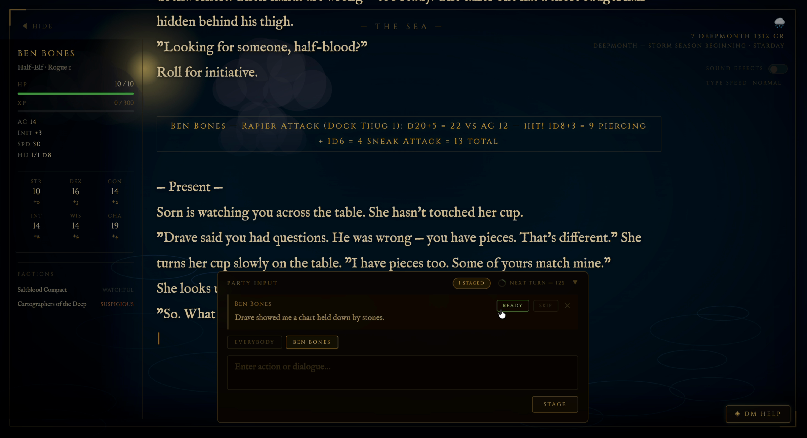
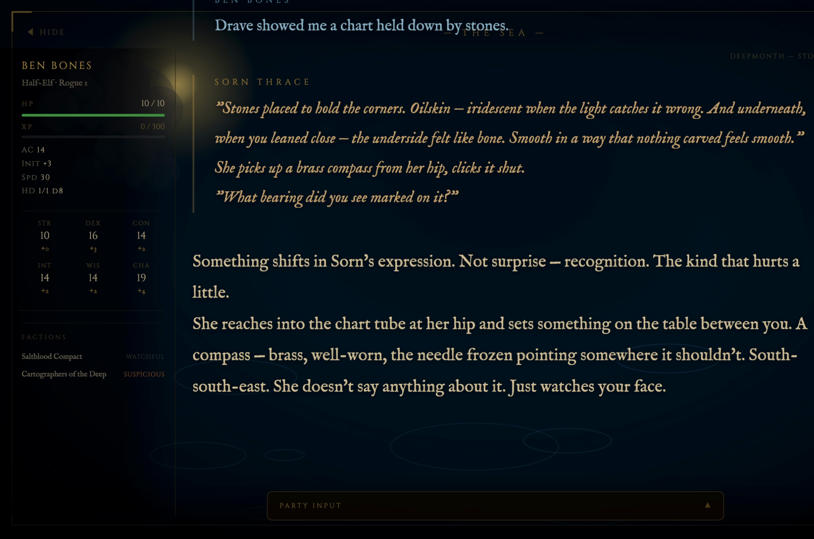

# Unofficial D&D Claude Dungeon Master
### *with Cinematic Display Companion — Couch Co-op Edition*

> Claude runs the game. You play. The TV shows the story. Your phone is your controller.

An unofficial D&D 5e Dungeon Master skill for [Claude Code](https://claude.ai/code) — persistent campaigns, full 5e mechanics, and an optional cinematic display companion that Chromecasts typewriter narration, dice rolls, and live character stats to your TV while players submit their actions from a phone or tablet.

Built for groups who want a real DM experience without needing one at the table.


---

## What This Is

You run `/dnd load my-campaign` in Claude Code. Claude becomes your DM — rolling dice, voicing NPCs, tracking HP and XP, and running combat. The **cinematic display companion** puts narration on the big screen in real time with a typewriter effect and atmospheric backgrounds. Players sit on the couch, open the companion on their phones, type their actions, and hit **Ready** — Claude picks up every submission automatically and runs the next turn without the DM pressing Enter.

It is not an official Wizards of the Coast product. It uses Claude as the DM engine. It takes the rules seriously and the storytelling even more seriously.

---

## Features

- **Persistent campaigns** — state, NPCs, quests, and characters survive across sessions in plain markdown files
- **Full D&D 5e mechanics** — initiative, attacks, saving throws, spell slots, XP, levelling up, short/long rests
- **Atmospheric DM** — dark fantasy tone, distinct NPC voices, hidden rolls, a world that reacts to choices
- **Cinematic display companion** — typewriter narration on your TV, scene-reactive backgrounds, live party sidebar
- **Player input from the companion UI** — players submit actions from phone/tablet; Claude picks them up automatically in autorun mode
- **Autorun / taxi mode** — Claude drives the turn loop without DM input; a pie countdown shows the next auto-fire window
- **LAN party support** — serve the companion over your local network; every device in the room sees the same display
- **TLS / HTTPS** — self-signed cert generation included; required for full browser feature support over LAN
- **17 scene types** — auto-detected from narration keywords — tavern, dungeon, ocean, crypt, arcane, glacier, and more
- **Combat tracker** — auto-rolled initiative, `▶` turn pointer, HP bars, inline dice math sent to display
- **6 helper scripts** — dice rolling, ability scores, combat, character stat derivation, calendar, data lookup

---

## How It Works

```
Claude Code CLI  ──→  /dnd commands  ──→  campaign files (~/.claude/dnd/)
                                              state.md · world.md · npcs.md
                                              session-log.md · characters/

Display pipeline (autorun mode):
  Players (phone/tablet)  ──→  Companion UI  ──→  Flask SSE server (localhost:5001)
                                                          ↓
                                                   autorun-wait.sh
                                                          ↓
                                                   Claude processes turn
                                                          ↓
                                              send.py / push_stats.py  ──→  TV display
```

The Flask server receives narration text, player actions, dice results, and character stats via HTTP POST. It broadcasts everything in real time to connected browsers via Server-Sent Events. The browser renders narration as a typewriter effect over a scene-reactive gradient background with a live character sidebar. In autorun mode Claude polls for player submissions and processes each turn automatically.

---

## Prerequisites

- [Claude Code](https://claude.ai/code) CLI installed
- Python 3.10+
- `pip3 install flask flask-cors` (display companion only)
- `pip3 install cryptography` (TLS cert generation — LAN mode only)

---

## Installation

```bash
# 1. Clone into your Claude skills directory
git clone https://github.com/Bobby-Gray/claude-dnd-skill ~/.claude/skills/dnd

# 2. Install display companion dependencies (optional)
pip3 install flask flask-cors cryptography

# 3. That's it — no other setup required
```

> **Claude Code skills** live in `~/.claude/skills/`. Once cloned, the `/dnd` command is available in any Claude Code session.

---

## Quick Start

```
/dnd new my-campaign         # create a new campaign
/dnd character new           # create a character
/dnd load my-campaign        # start a session (asks about display companion)
```

Once loaded, type naturally — no `/dnd` prefix needed. The DM interprets everything as in-game action.

---

## Campaign Commands

| Command | Description |
|---------|-------------|
| `/dnd new <name>` | Create a new campaign — generates world seed, NPCs, starting location |
| `/dnd load <name>` | Load an existing campaign and enter DM mode |
| `/dnd save` | Write session events to log, update state and character files |
| `/dnd end` | Save session, append recap, stop display companion |
| `/dnd abandon` | Exit without saving — discards all unsaved changes from this session |
| `/dnd list` | List all campaigns with last session date and count |
| `/dnd recap` | In-character 3–5 sentence recap of the last session |
| `/dnd world` | Display world lore |
| `/dnd quests` | Show active quests and open threads |
| `/dnd autorun on [seconds]` | Enable autorun mode — Claude drives the turn loop automatically |
| `/dnd autorun off` | Return to manual mode |

---

## Character Commands

| Command | Description |
|---------|-------------|
| `/dnd character new` | Create a character — guided point buy or rolled stats |
| `/dnd character sheet [name]` | Display a character sheet |
| `/dnd level up [name]` | Level up a character — applies class features, HP roll |

### Character Creation

The creation flow walks through:
1. Name, race, class, background
2. **Point buy** (validates against 27-point budget) or **rolled** (3 arrays of 4d6kh3 to choose from)
3. Racial bonuses applied automatically
4. Derived stats calculated via `character.py`
5. Starting equipment assigned by class + background
6. Sheet written to `characters/<name>.md`

---

## Combat System

```
/dnd combat start
```

1. Identifies all combatants, collects DEX mods, HP, AC
2. Auto-rolls initiative for **every combatant** including PCs — results sent to display
3. Tracks HP, conditions, turn order across rounds
4. Resolves NPC/monster attacks inline with full dice math:
   ```
   Goblin attacks: d20(14) + 4 = 18 vs AC 16 — hit! 1d6(3) + 2 = 5 piercing
   ```
5. Players roll their own attack/skill/save numbers — DM resolves everything else

### Combat Display

During combat the sidebar shows a live turn order with a `▶` pointer:

```
— COMBAT — Round 2
▶ Aldric
  Skeleton
  Mira
```

The pointer advances after each turn. HP bars update in real time when damage is taken. Combat ends with `--turn-clear`.

---

## NPC System

```
/dnd npc Osk             # portray an existing NPC or generate a new one
/dnd npc attitude Osk friendly   # shift attitude on the 5-step scale
```

Every NPC gets: role, stat block, demeanor, motivation, secret, and a speech quirk. Attitudes shift on a 5-step scale: `hostile → unfriendly → neutral → friendly → allied`. Changes are logged with reason and date in `npcs.md`.

---

## Resting

```
/dnd rest short    # 1 hour — spend Hit Dice, recharge some features
/dnd rest long     # 8 hours — full HP, half Hit Dice back, all spell slots
```

Long rests advance the in-world clock in `state.md`.

---

## Cinematic Display Companion

An optional local web server (`display/app.py`) that renders the session on any screen — designed to be Chromecasted to a TV during play, with players submitting actions from their phones.

### Setup

```bash
pip3 install flask flask-cors cryptography
```

### Starting the Display

The display starts automatically when you answer **y** at the `/dnd load` prompt. Or start it manually:

```bash
# Local only (Mac/same machine)
bash ~/.claude/skills/dnd/display/start-display.sh

# LAN mode — accessible to phones/tablets on your network
bash ~/.claude/skills/dnd/display/start-display.sh --lan
```

Then open `https://localhost:5001` in your browser. The first time you'll see a certificate warning for the self-signed cert — click through it. For LAN devices use the IP URL printed at startup (e.g. `https://192.168.1.x:5001`).

### TLS / HTTPS Setup

LAN mode requires HTTPS (mobile browsers require it for SSE and clipboard features). A self-signed cert is generated automatically on first `--lan` start, or you can regenerate it manually:

```bash
python3 ~/.claude/skills/dnd/display/setup_tls.py
```

This creates `cert.pem` + `key.pem` in the display folder with SANs for `localhost` and your current LAN IP. Import `cert.pem` into your phone's trusted certs to eliminate the browser warning on mobile.

### Player Input from the Companion UI



Players open the companion in their phone browser. The **Party Input** panel at the bottom lets each player:

1. **Stage** an action — type it and hit Stage. It appears in the panel visible to everyone.
2. **Mark Ready** — confirms the action is final.
3. **Skip** — passes the turn without typing.

When all players (or a configured minimum) are ready, the combined input fires to Claude automatically.

The panel shows a **"Next Turn"** countdown pie clock that loops at the configured interval. When a submission is picked up, the "Queued" indicator clears and three pulsing dots appear in the main chat confirming Claude received it and is thinking.

### Autorun Mode

Autorun is the primary way to run sessions with the companion UI. Once enabled, Claude drives the turn loop without requiring the DM to press Enter between each turn.

```
/dnd autorun on          # enable — 60s default countdown
/dnd autorun on 45       # enable with 45-second countdown
/dnd autorun off         # return to manual mode
```

The countdown is configurable per-campaign by setting `autorun_interval: N` in `state.md → ## Session Flags`. To interrupt autorun from the Claude Code CLI, press **Ctrl+C** during the wait.

**N-player threshold** — by default autorun fires when all known players are ready. For multi-device groups you can require only N players:

```bash
python3 ~/.claude/skills/dnd/display/push_stats.py --autorun-threshold 2  # fire when 2 ready
python3 ~/.claude/skills/dnd/display/push_stats.py --autorun-threshold 0  # reset to player count
```

### Scene Detection

The server scans narration text for keywords and crossfades the background gradient and particle type to match the current environment. Scenes change automatically as the story moves.

| Scene | Trigger Keywords | Particles |
|-------|-----------------|-----------|
| Tavern | inn, hearth, ale, tallow, barkeep | embers |
| Dungeon | corridor, torch, portcullis, dank | dust |
| Ocean / Docks | dock, harbour, wave, tide, ship | bubbles |
| Forest | tree, canopy, moss, thicket, grove | fireflies |
| Crypt | tomb, undead, skeleton, burial | smoke |
| Arcane | ritual, rune, sigil, incantation | sparks |
| Mountain | glacier, frost, blizzard, ridge | snow |
| Cave | stalactite, grotto, echo, drip | drips |
| Night | midnight, moon, constellation | stars |
| City / Town | market, cobble, district, crowd | rain |
| + 7 more | mine, castle, ruins, swamp, desert, fire, temple | — |

Scene transitions crossfade over ~2.5 seconds. The server maintains a 20-chunk rolling window for detection so scenes don't flicker on single keyword matches.

### Live Character Sidebar



A fixed left sidebar shows live stats for all party members, updated automatically as play progresses.

```bash
# Push full stats on campaign load (clears stale characters from previous campaigns)
python3 ~/.claude/skills/dnd/display/push_stats.py --replace-players --json '{
  "players": [{
    "name": "Aldric", "race": "Human", "class": "Fighter", "level": 2,
    "hp": {"current": 14, "max": 18}, "xp": {"current": 220, "next": 300},
    "ac": 17, "initiative": "+1", "speed": 30,
    "hit_dice": {"remaining": 2, "max": 2, "die": "d10"}
  }]
}'

# Partial updates during play
python3 ~/.claude/skills/dnd/display/push_stats.py --player Aldric --hp 10 18
python3 ~/.claude/skills/dnd/display/push_stats.py --player Aldric --xp 270 300
python3 ~/.claude/skills/dnd/display/push_stats.py --player Aldric --conditions-add "Poisoned"
python3 ~/.claude/skills/dnd/display/push_stats.py --player Aldric --slot-use 2

# Combat turn order
python3 ~/.claude/skills/dnd/display/push_stats.py \
  --turn-order '{"order":["Aldric","Skeleton","Mira"],"current":"Aldric","round":1}'

# Advance turn pointer
python3 ~/.claude/skills/dnd/display/push_stats.py --turn-current "Skeleton"

# Combat ended
python3 ~/.claude/skills/dnd/display/push_stats.py --turn-clear
```

The sidebar:
- Shows compact dual-column cards for parties of 2+ (full ability grid for solo play)
- HP bars shift green → yellow → red as HP drops
- XP bar fills toward next level
- Active conditions displayed per character
- Spell slot pips track remaining charges
- Fades in automatically on first stats push
- Persists across Flask restarts (`stats.json`)
- Cleared automatically on `/dnd new` (fresh campaign)

### Replay Buffer

The server buffers the last 60 text chunks to disk (`text_log.json`). Reconnecting browsers (Chromecast drop, tab refresh) replay the full session history automatically — no narration is lost.

---

## Scripts Reference

All scripts live in `~/.claude/skills/dnd/scripts/`.

### `dice.py` — All dice rolls

```bash
python3 scripts/dice.py d20+5
python3 scripts/dice.py 2d6+3
python3 scripts/dice.py d20 adv          # advantage
python3 scripts/dice.py d20+3 dis        # disadvantage + modifier
python3 scripts/dice.py 4d6kh3          # keep highest 3 (ability score roll)
python3 scripts/dice.py d20 --silent    # integer only (for hidden rolls)
```

Flags nat 20 (`CRITICAL HIT`) and nat 1 (`FUMBLE`) automatically.

### `ability-scores.py` — Character creation

```bash
python3 scripts/ability-scores.py roll                          # 3 arrays to choose from
python3 scripts/ability-scores.py pointbuy                     # print cost table
python3 scripts/ability-scores.py pointbuy --check STR=15 DEX=10 CON=15 INT=8 WIS=11 CHA=12
python3 scripts/ability-scores.py modifiers STR=15 DEX=10 CON=15 INT=8 WIS=11 CHA=12
```

### `combat.py` — Initiative and attack resolution

```bash
# Roll initiative for all combatants and print tracker
python3 scripts/combat.py init '[
  {"name":"Aldric","dex_mod":1,"hp":18,"ac":17,"type":"pc"},
  {"name":"Skeleton","dex_mod":2,"hp":13,"ac":13,"type":"npc"}
]'

# Resolve a single attack
python3 scripts/combat.py attack --atk 5 --ac 13 --dmg 1d8+3
```

### `character.py` — Stat derivation and levelling

```bash
# Full stat block from raw scores
python3 scripts/character.py calc --class fighter --level 2 \
    STR=16 DEX=12 CON=15 INT=10 WIS=11 CHA=13 \
    --proficient STR CON Athletics Intimidation Perception Survival

# Level-up
python3 scripts/character.py levelup --class fighter --from 2 --hp-roll 8 --con-mod 2

# XP tracking
python3 scripts/character.py xp --level 2 --gained 150
```

---

## File Layout

```
~/.claude/skills/dnd/
├── SKILL.md                  # Skill definition and DM instructions
├── SKILL-scripts.md          # Script and tool syntax reference
├── SKILL-commands.md         # /dnd command procedures
├── README.md                 # This file
├── scripts/
│   ├── dice.py
│   ├── ability-scores.py
│   ├── combat.py
│   ├── character.py
│   ├── calendar.py
│   └── lookup.py
├── display/
│   ├── app.py                # Flask SSE server
│   ├── autorun-wait.sh       # Blocking wait script for autorun mode
│   ├── send.py               # Direct send for narration/dice/player actions
│   ├── push_stats.py         # Character and combat stat updates
│   ├── setup_tls.py          # Self-signed TLS cert generator for LAN mode
│   ├── start-display.sh      # One-command display startup
│   ├── dm_help.py            # On-demand DM hint generator (◈ button)
│   ├── check_input.py        # Legacy player input queue reader
│   ├── wrapper.py            # PTY wrapper (legacy — autorun preferred)
│   ├── requirements.txt
│   └── templates/
│       └── index.html        # Browser frontend
└── templates/
    ├── character-sheet.md
    ├── state.md
    ├── world.md
    ├── npcs.md
    └── session-log.md

~/.claude/dnd/campaigns/<name>/
├── state.md                  # Current location, party status, active quests
├── world.md                  # World lore and setting details
├── npcs.md                   # NPC index with stat blocks and attitudes
├── session-log.md            # Session history and recaps
└── characters/
    ├── Aldric.md
    └── Mira.md
```

---

## DM Philosophy

The skill is designed around a set of hard constraints, not aspirational notes:

- **Improvise over script** — the world is a sandbox; player choices always find a "yes, and..."
- **Consequences are real** — NPCs remember conversations; factions shift; failure is possible
- **Economy of description** — two sharp sensory details beat a paragraph of exposition
- **Every NPC is a person** — even minor characters get a verbal tic, a contradiction, a goal
- **Hidden rolls stay hidden** — Perception, Insight, and Stealth roll silently; only the outcome is narrated (but results always appear on the display)

---

## License

MIT
